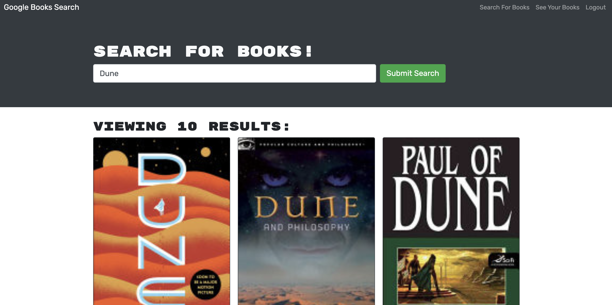

# MERN Book Search

## Description

A book search engine, created using the MERN stack that has been refactored into a GraphQL API, built with Apollo Server.

## Links

    * Github repo:
        https://github.com/ChristinaBohn/mern-book-search
        
    * Heroku deployment:
        https://book-search-engine-cb.herokuapp.com/

## Technologies Used

    * MongoDB
    * Express.js
    * ReactJS
    * Node.js
    * GraphQL
    * Apollo Server

## Preview

